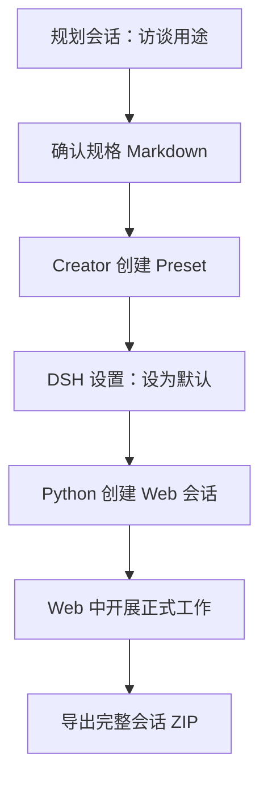

# 设计稿：从访谈到专用工作会话

## 目标

将“一次规划聊天”转成可重复使用的 DSH Agent Preset，再由外部 Python 程序创建采用该预设的独立 Web 会话。规划会话保留决策过程；正式会话只获得确认后的角色和能力，不依赖复制整段旧历史。

## 用户流程



### 第一段：Preset 制作

访谈按目的、输入、输出、能力、工作区、例外、验收样例收集信息。结果是有版本的规格，而不是一串临时聊天要求。Creator 基于目标 DSH 版本的内置 `standard` 预设构建新 Preset，记录插件行、persona、权限与依赖。健康检查通过之后，在 DSH 设置中标记为默认。

DSH 0.1.7 附近有 Preset 声明格式变迁，不能把旧目录型配置直接复制进新版本。Creator 必须在目标安装环境里确认格式、生成配置并试挂载。这样便于适应插件行和配置字段的变化。

### 第二段：Python 创建器

输入：DSH Web 本机地址、现有目录或工作区 ID、可选 Preset ID。输出：新会话 ID、请求记录 JSON。显式 ID 用在创建请求中；省略时交给 DSH 默认预设。创建器不自造会话日志、不直接改 DSH 内部文件。

调用顺序：

1. 使用 DSH 启动链接换 Cookie（新版）；保存到 0600 的本机 Cookie 文件。
2. 调用 `agentPresets/list` 或旧 `agentPreset.list`，若指定了 ID，检查它是否存在。
3. 如果要求登记工作区，则调用 `workspace/create` 或旧 `workspace.create`。
4. 调用 `session/create` 或旧 `session.create`，携带 `workspaceId`/`cwd`、`sessionId`、可选 `agentPreset`。
5. 严格校验 RPC 信封、业务结果和返回 ID，写入本地记录。
6. 工作完成后，按 ID 调用原生导出端点，把根会话、子会话和附件保存为 ZIP。

新版 RPC 一律使用 `/api/<namespace>/<method>`、`payload.args`；旧版使用点分方法和原始业务 payload。只对 HTTP 404 作版本回退，401、配置错误及业务错误原样呈现。

## 数据与留存

| 资产 | 创建时机 | 建议存放 | 作用 |
| --- | --- | --- | --- |
| 访谈提示词 | 规划前 | `templates/01-*` | 引导澄清需求 |
| 已确认规格 | 规划后 | 从 `templates/02-*` 另存为项目文档 | Preset 的事实来源 |
| Creator 施工说明 | 配置前 | `templates/03-*` | 防止跨版本误装 |
| Preset 配置与依赖清单 | Creator 完成后 | 用户自己的项目仓库 | 可复现与审查 |
| 会话创建回执 | Python 创建后 | `records/<id>.json` | 对应工作区、预设和时间 |
| 原始完整会话 | 工作结束后 | `records/dsh-session-<id>.zip` | 保留事件、工具和附件 |
| 预设能力画像 | `observe` 学习后 | `~/.config/dsh-conversation-studio/memory.json` | 回答「该用哪个预设」 |
| 使用偏好 | 每次选择后 | 同上 | 按项目/场景统计习惯 |

## 第三段：预设选型记忆

前两段解决「怎么做出一个预设」，第三段解决「**已有这么多预设，该用哪个**」。

### 要解决的问题

预设数量增长后，选择成本上升：记不住每个预设到底带哪些工具，跨会话也会忘。
原先只能靠模型自述工具清单，实测不可靠——同一预设三次测量得到 13 / 2 / 0 三种结果。

### 权威来源

会话导出 ZIP 里的 `request/header` 事件携带 **DSH 发给模型的真实工具清单**。
这是宿主自己的视图，不是模型的描述，因此稳定可程序化断言。

一个会话只能反映它自己创建时锁定的预设，所以**每学习一个预设需要一个它的会话归档**。

### 数据模型

```json
{
  "schema": 1,
  "profiles": {
    "<preset-id>": {
      "preset": "review-focused",
      "tools": ["bash", "read", "grep", "..."],
      "tool_count": 24,
      "entries": 16,
      "notes": "适合只读审阅",
      "first_seen": "...", "observed_at": "...", "tools_changed_at": "...",
      "cwd": "...", "session_id": "...", "source_zip": "..."
    }
  },
  "preferences": [
    {"preset": "...", "cwd": "...", "scenario": "...", "session_id": "...", "at": "..."}
  ],
  "incidents": [
    {"preset": "...", "symptom": "...", "detail": "...", "at": "..."}
  ]
}
```

**每条记录都可追溯**：画像记着来源归档，偏好记着会话 ID，事故记着现象。
推荐结果因此永远可解释、可纠正。

### 关键设计决策

**1. 工具面来自宿主，不来自模型。** 见上。这是整个功能能成立的前提。

**2. 习惯是打平时的加分，不是覆盖。** 排序先按功能匹配
（`满足数 − 2 × 多余数`），习惯只加一个有上限的递减分。
**一个你常用、但缺你明确要求的工具的预设，仍然是错误答案。**
这一条有专门的回归测试锁定，因为第一版实现正是踩了这个坑。

**3. 记忆是观察记录，不是 DSH 状态的缓存。** DSH 始终是「存在什么」的真相来源；
记忆只记录「观察到什么、选了什么」。preset 被删除后，记忆里的画像不会让
`new` 凭空造出会话——创建前仍以 roster 为准。

**4. 不引入数据库。** 全部内容是几 KB 的可读 JSON，可 diff、可 grep、可人工修正。
写入用临时文件 + `replace` 原子替换，权限 `0600`（可能含项目路径与预设意图）。
读取失败时重建而非崩溃——记忆不该阻塞主流程。

## 权限与失败处理

- 脚本只允许连接 `localhost`、`127.0.0.1` 或 `::1` 的 HTTP 地址；远端服务使用本机 SSH 隧道。
- 含 token 的启动 URL 和 Cookie 均不写进会话回执或分享包。Cookie 文件单独保存在用户主目录，权限设为 0600。
- 传入不存在的 Preset 时在创建前报错。DSH 业务层拒绝创建时不重试到其他预设。
- **空白会话（`blank: true`）会被 Web 侧栏隐藏。** 这是 DSH 的既定行为，不是故障。
  `send` 子命令发一条消息即可使其可见；`--wait` 会轮询到脱离该状态并报告结果。
- 超时恰在服务端提交之后时可能已创建成功，使用同一 `--session-id` 重试前先核对 Web 中的状态。
- 认证失效时自动用启动链接换一次新 Cookie（仅重试一次）；仍失败才提示人工处理。
- 已有导出 ZIP 和已有回执拒绝覆盖，避免误删资料。
- 记忆文件损坏时不抛异常，重建为空记忆继续工作。

## 验收

1. 新版与旧版的伪 Web 服务均接收到正确路径、信封和参数。✅
2. 新版 token 换 Cookie 后，另一次进程调用可读取本机缓存并导出有效 ZIP。✅
3. 不存在的预设、本机之外的 URL 和错误信封均失败明确。✅
4. 失效 Cookie 能自愈，损坏缓存不中断运行，矛盾参数被拒绝。✅
5. 在真实 DSH 上检查预设实际生效、首条任务运行和日志导出。✅
6. `send` 之后会话脱离 `blank` 状态并在侧栏可见。✅
7. 从会话归档提取的工具清单与该会话实际能力一致。✅
8. 推荐结果可解释，且不会因使用习惯而推荐缺工具的预设。✅

第 4–8 项在 DSH 0.1.5-rc.1 上实测通过，明细见 [测试记录.md](测试记录.md)。

